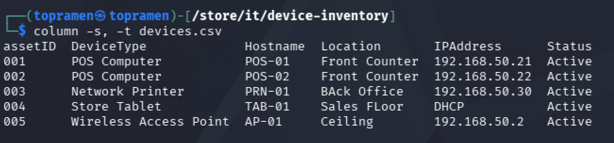
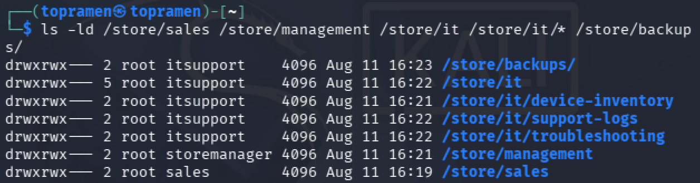
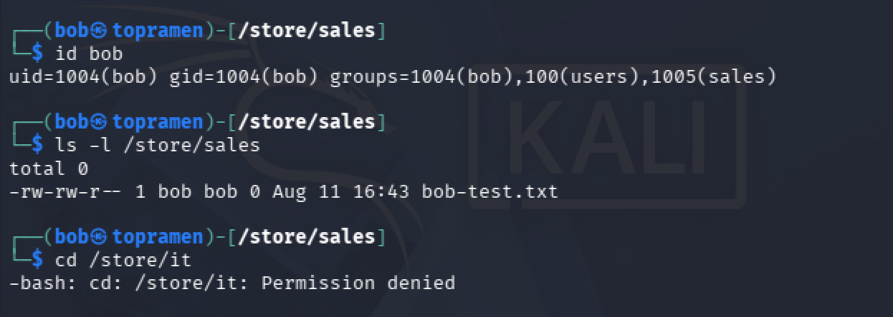
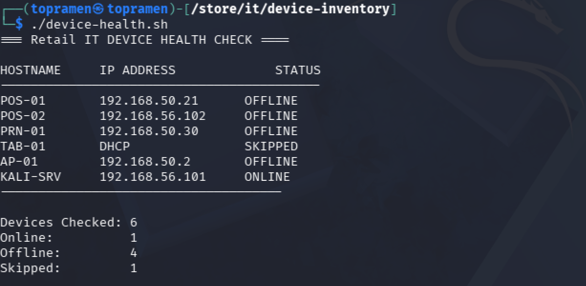
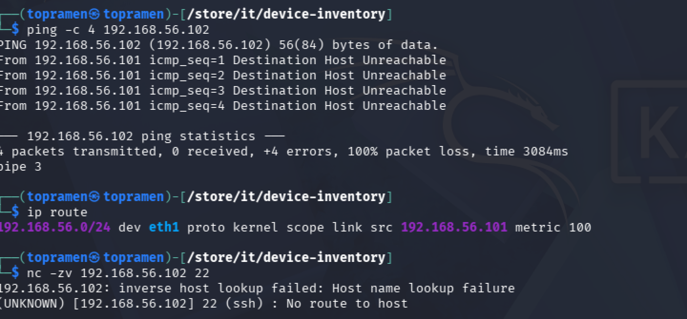
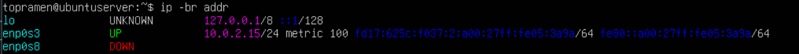
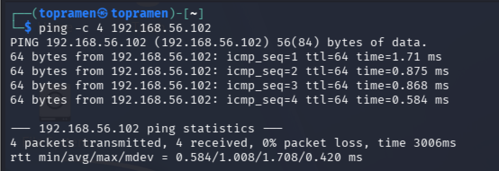

# Retail IT Infrastructure & Support Lab

A hands-on IT support and systems administration lab designed to simulate the technology environment of a retail location.

This project demonstrates Linux administration, role-based access control, device inventory management, automated device monitoring, network troubleshooting, and incident response using a virtualized lab environment.

## Project Overview

The lab simulates a retail store containing POS computers, a network printer, tablet, wireless access point, Linux servers, and separate user roles.

The environment was designed to practice real-world responsibilities commonly performed by IT Support Specialists, Help Desk Technicians, Desktop Support Technicians, and Junior System Administrators.

### Technologies & Skills

- Linux / Ubuntu Server
- Kali Linux
- Oracle VirtualBox
- Bash scripting
- TCP/IP networking
- ICMP / Ping
- SSH troubleshooting
- Linux users and groups
- File and directory permissions
- Role-Based Access Control (RBAC)
- Device inventory management
- Network interface troubleshooting
- Incident documentation

## Lab Environment

Example retail devices were documented in a CSV-based inventory.

| Asset ID | Device | Hostname | Location |
|---|---|---|---|
| 001 | POS Computer | POS-01 | Front Counter |
| 002 | POS Computer | POS-02 | Front Counter |
| 003 | Network Printer | PRN-01 | Back Office |
| 004 | Store Tablet | TAB-01 | Sales Floor |
| 005 | Wireless Access Point | AP-01 | Ceiling |

### Device Inventory

The inventory tracks asset IDs, device types, hostnames, locations, IP addresses, and device status.



## Role-Based Access Control

Linux users, groups, ownership, and directory permissions were configured to simulate access separation between sales, management, and IT personnel.



A test sales account was then used to verify the permissions. The sales user could access the sales directory but received `Permission denied` when attempting to enter the protected IT directory.



## Automated Device Health Monitoring

A Bash script was created to perform automated connectivity checks against devices in the simulated retail environment.

The script reports devices as:

- ONLINE
- OFFLINE
- SKIPPED

It also produces a summary showing the number of devices checked and their current connectivity state.



## Network Troubleshooting Scenario

A simulated connectivity incident was created involving POS-02.

Initial testing showed that the device could not be reached. Troubleshooting included:

- ICMP connectivity testing with `ping`
- Reviewing the routing table with `ip route`
- Testing TCP port 22 with Netcat
- Inspecting network interfaces
- Identifying an unavailable network path



## Root Cause Isolation

During troubleshooting, the Ubuntu network interface associated with the lab network was intentionally brought down to reproduce a connectivity failure.

`ip -br addr` confirmed that the interface was in a `DOWN` state.



This demonstrated how an interface or network configuration issue can cause a device to become unreachable even when the rest of the system is operational.

## Connectivity Restoration

After restoring the network interface and correcting connectivity between the virtual systems, POS-02 successfully responded to ICMP requests.

The final verification produced:

- 4 packets transmitted
- 4 packets received
- 0% packet loss



## Incident Response Workflow

The troubleshooting process followed a basic IT incident lifecycle:

1. Detect the connectivity problem.
2. Confirm the affected device.
3. Test network reachability.
4. Inspect routing and network interfaces.
5. Isolate the source of the failure.
6. Restore connectivity.
7. Verify successful communication.
8. Document the incident and resolution.

Incident documentation is stored in the `inventory/incidents/` directory.

## Repository Structure

```text
retail-it-infrastructure/
├── inventory/
│   ├── devices.csv
│   └── incidents/
│       └── INC-001.md
├── scripts/
│   └── device-health.sh
├── 03-role-based-directory-permissions.png
├── 04-rbac-access-verification.png
├── 05-device-health-monitor.png
├── 06-retail-device-inventory.png
├── 07-pos02-troubleshooting.png
├── 08-ubuntu-interface-down.png
├── 09-connectivity-restored.png
└── README.md
```

## What I Learned

This project provided hands-on experience with troubleshooting an IT environment instead of only studying commands individually.

Key takeaways included:

- Managing Linux users, groups, and permissions
- Implementing role-based access restrictions
- Maintaining an IT asset inventory
- Writing Bash scripts to automate device checks
- Diagnosing connectivity problems using Linux networking tools
- Understanding interfaces, routing, ICMP, and TCP connectivity
- Simulating and resolving a network outage
- Documenting troubleshooting steps and incident resolution

## Project Purpose

This lab was created as a practical portfolio project to demonstrate foundational skills relevant to:

**IT Support | Help Desk | Desktop Support | Junior Systems Administration | Technical Support**

The environment is entirely virtualized and uses simulated retail infrastructure for training purposes.
